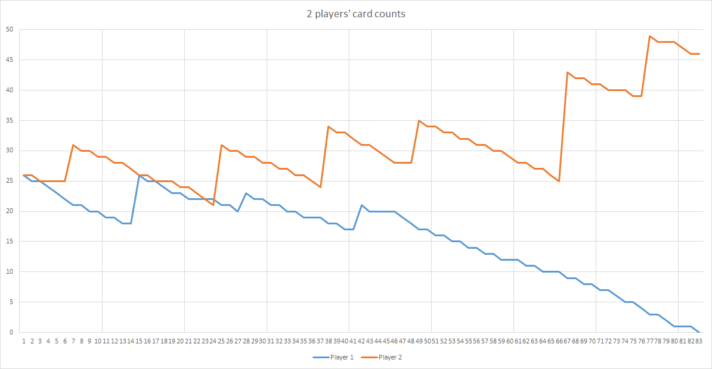

# :spades: :hearts: :crown: :clubs: :diamonds: Kingplayer :diamonds: :clubs: :crown: :hearts: :spades:

# :diamonds: Aims
- Simulate 'Three for a King' with 2-52 multiple players
- Count 'place counts' (number of times a card was placed on the pile) - effectively measuring game length
- Find high and low length games using many plays of shuffled decks
- Show distributions of game length using graphs
- Find high and low length games using a genetic algorithm to evolve a starting deck

# :spades: About _Three for a King_

From [Wikipedia](https://en.wikipedia.org/wiki/Beggar-my-neighbour):

```
A standard 52-card deck is divided equally between two players, and
the two stacks of cards are placed on the table face down. The first
player lays down his top card face up, and the opponent plays his top
card, also face up, on it, and this goes on alternately as long as no
ace or face card (king, queen, or jack) appears. These cards are
called "penalty cards."

If either player turns up such a card, his opponent has to pay a penalty:
four cards for an ace, three for a king, two for a queen, or one for a jack.
When he has done so, the player of the penalty card wins the hand,
takes all the cards in the pile and places them under his pack.
The game continues in the same fashion, the winner having the advantage
of placing the first card.
However, if the second player turns up another ace or face card in the
course of paying to the original penalty card, his payment ceases and
the first player must pay to this new card. This changing of
penalisation can continue indefinitely. The hand is lost by the player
who, in playing his penalty, turns up neither an ace nor a face card.
Then, his opponent acquires all of the cards in the pile. When a
single player has all of the cards in the deck in his stack, he has won.
```

_Three for a King_ is deterministic. Once the deck is shuffled, the cards are dealt, and the first player is selected, the winner is decided and cannot be changed. There is no strategy or luck involved after the cards are dealt. Instead, the winner is revealed to the players by following the simple rules detailed above until only one player is left holding any cards.

Its simplicity makes it a good first card game for children.

One unsolved problem in mathematics is the question of whether or not an [infinite game](https://en.wikipedia.org/wiki/Beggar-my-neighbour#Relation_to_mathematics) can occur.

# :hearts: Playing a game

A very short game between **2 players** might look like this:

```
[G] This game has 2 players.
[G] Dealing...
[P] Player 1 places Jack on the pile. 25 cards left. This demands a tax of 1 cards from the next player.
[T] Player 2 places Ace on the pile. 25 cards left. This demands a tax of 4 cards from the next player.
[T] Player 1 places 8 on the pile. 24 cards left.
[T] Player 1 places 4 on the pile. 23 cards left.
[T] Player 1 places 7 on the pile. 22 cards left.
[T] Player 1 places 6 on the pile. 21 cards left.
[T] Player 2 grabs the pile and adds it to the bottom of theirs. Now they have 31 cards.
[P] Player 2 places 4 on the pile. 30 cards left.
[P] Player 1 places 2 on the pile. 20 cards left.
[P] Player 2 places 6 on the pile. 29 cards left.
[P] Player 1 places King on the pile. 19 cards left. This demands a tax of 3 cards from the next player.
[T] Player 2 places Ace on the pile. 28 cards left. This demands a tax of 4 cards from the next player.
[T] Player 1 places Queen on the pile. 18 cards left. This demands a tax of 2 cards from the next player.
[T] Player 2 places 4 on the pile. 27 cards left.
[T] Player 2 places 8 on the pile. 26 cards left.
[T] Player 1 grabs the pile and adds it to the bottom of theirs. Now they have 26 cards.
[P] Player 1 places 3 on the pile. 25 cards left.
[P] Player 2 places Ace on the pile. 25 cards left. This demands a tax of 4 cards from the next player.
[T] Player 1 places 2 on the pile. 24 cards left.
[T] Player 1 places Queen on the pile. 23 cards left. This demands a tax of 2 cards from the next player.
[T] Player 2 places Queen on the pile. 24 cards left. This demands a tax of 2 cards from the next player.
[T] Player 1 places King on the pile. 22 cards left. This demands a tax of 3 cards from the next player.
[T] Player 2 places 8 on the pile. 23 cards left.
[T] Player 2 places 7 on the pile. 22 cards left.
[T] Player 2 places Jack on the pile. 21 cards left. This demands a tax of 1 cards from the next player.
[T] Player 1 places 9 on the pile. 21 cards left.
[T] Player 2 grabs the pile and adds it to the bottom of theirs. Now they have 31 cards.
[P] Player 2 places 3 on the pile. 30 cards left.
[P] Player 1 places Jack on the pile. 20 cards left. This demands a tax of 1 cards from the next player.
[T] Player 2 places 10 on the pile. 29 cards left.
[T] Player 1 grabs the pile and adds it to the bottom of theirs. Now they have 23 cards.
[P] Player 1 places 3 on the pile. 22 cards left.
[P] Player 2 places 3 on the pile. 28 cards left.
[P] Player 1 places 10 on the pile. 21 cards left.
[P] Player 2 places 9 on the pile. 27 cards left.
[P] Player 1 places 7 on the pile. 20 cards left.
[P] Player 2 places 5 on the pile. 26 cards left.
[P] Player 1 places King on the pile. 19 cards left. This demands a tax of 3 cards from the next player.
[T] Player 2 places 5 on the pile. 25 cards left.
[T] Player 2 places Jack on the pile. 24 cards left. This demands a tax of 1 cards from the next player.
[T] Player 1 places 6 on the pile. 18 cards left.
[T] Player 2 grabs the pile and adds it to the bottom of theirs. Now they have 34 cards.
[P] Player 2 places 5 on the pile. 33 cards left.
[P] Player 1 places Queen on the pile. 17 cards left. This demands a tax of 2 cards from the next player.
[T] Player 2 places 5 on the pile. 32 cards left.
[T] Player 2 places 8 on the pile. 31 cards left.
[T] Player 1 grabs the pile and adds it to the bottom of theirs. Now they have 21 cards.
[P] Player 1 places Ace on the pile. 20 cards left. This demands a tax of 4 cards from the next player.
[T] Player 2 places 4 on the pile. 30 cards left.
[T] Player 2 places 10 on the pile. 29 cards left.
[T] Player 2 places King on the pile. 28 cards left. This demands a tax of 3 cards from the next player.
[T] Player 1 places 9 on the pile. 19 cards left.
[T] Player 1 places 2 on the pile. 18 cards left.
[T] Player 1 places 7 on the pile. 17 cards left.
[T] Player 2 grabs the pile and adds it to the bottom of theirs. Now they have 35 cards.
[P] Player 2 places 9 on the pile. 34 cards left.
[P] Player 1 places 6 on the pile. 16 cards left.
[P] Player 2 places 10 on the pile. 33 cards left.
[P] Player 1 places 2 on the pile. 15 cards left.
[P] Player 2 places 6 on the pile. 32 cards left.
[P] Player 1 places 8 on the pile. 14 cards left.
[P] Player 2 places 7 on the pile. 31 cards left.
[P] Player 1 places 4 on the pile. 13 cards left.
[P] Player 2 places 4 on the pile. 30 cards left.
[P] Player 1 places Queen on the pile. 12 cards left. This demands a tax of 2 cards from the next player.
[T] Player 2 places 8 on the pile. 29 cards left.
[T] Player 2 places Ace on the pile. 28 cards left. This demands a tax of 4 cards from the next player.
[T] Player 1 places Ace on the pile. 11 cards left. This demands a tax of 4 cards from the next player.
[T] Player 2 places Jack on the pile. 27 cards left. This demands a tax of 1 cards from the next player.
[T] Player 1 places King on the pile. 10 cards left. This demands a tax of 3 cards from the next player.
[T] Player 2 places 9 on the pile. 26 cards left.
[T] Player 2 places Jack on the pile. 25 cards left. This demands a tax of 1 cards from the next player.
[T] Player 1 places 6 on the pile. 9 cards left.
[T] Player 2 grabs the pile and adds it to the bottom of theirs. Now they have 43 cards.
[P] Player 2 places 7 on the pile. 42 cards left.
[P] Player 1 places 2 on the pile. 8 cards left.
[P] Player 2 places 8 on the pile. 41 cards left.
[P] Player 1 places 4 on the pile. 7 cards left.
[P] Player 2 places King on the pile. 40 cards left. This demands a tax of 3 cards from the next player.
[T] Player 1 places 10 on the pile. 6 cards left.
[T] Player 1 places Jack on the pile. 5 cards left. This demands a tax of 1 cards from the next player.
[T] Player 2 places Queen on the pile. 39 cards left. This demands a tax of 2 cards from the next player.
[T] Player 1 places 3 on the pile. 4 cards left.
[T] Player 1 places 8 on the pile. 3 cards left.
[T] Player 2 grabs the pile and adds it to the bottom of theirs. Now they have 49 cards.
[P] Player 2 places Queen on the pile. 48 cards left. This demands a tax of 2 cards from the next player.
[T] Player 1 places 5 on the pile. 2 cards left.
[T] Player 1 places Queen on the pile. 1 cards left. This demands a tax of 2 cards from the next player.
[T] Player 2 places 2 on the pile. 47 cards left.
[T] Player 2 places Ace on the pile. 46 cards left. This demands a tax of 4 cards from the next player.
[T] Player 1 places 5 on the pile. 0 cards left.
[L] Player 1 is out of the game!
[G] Player 2 wins!
82 cards were placed during the game.
```



A game between **5 players** might look like this (truncated):

```
[G] This game has 5 players.
[G] Dealing...
[P] Player 1 places 5 on the pile. 10 cards left.
[P] Player 2 places 7 on the pile. 10 cards left.
[P] Player 3 places 5 on the pile. 9 cards left.
[P] Player 4 places 4 on the pile. 9 cards left.
[P] Player 5 places Ace on the pile. 9 cards left. This demands a tax of 4 cards from the next player.
[T] Player 1 places Queen on the pile. 9 cards left. This demands a tax of 2 cards from the next player.
...
[G] Player 3 wins!
173 cards were placed during the game.
```


If you are nuts you can even simulate a game with 52 players:


It quickly became a 2-player game as resources (picture cards) were so scarce.

# :clubs: Plot distribution - highest and lowest in a MILLION games?

## Distribution graphs

### :beers: 2 players


|:ant: lowest|:whale: highest|:bar_chart: mean average (rounded)|
|---|---|---|
|35|2620|223|

### :beer: 3 players


|:ant: lowest|:whale: highest|:bar_chart: mean average (rounded)|
|---|---|---|
|46|2912|284|

### :beers: 4 players


|:ant: lowest|:whale: highest|:bar_chart: mean average (rounded)|
|---|---|---|
|47|2498|312|